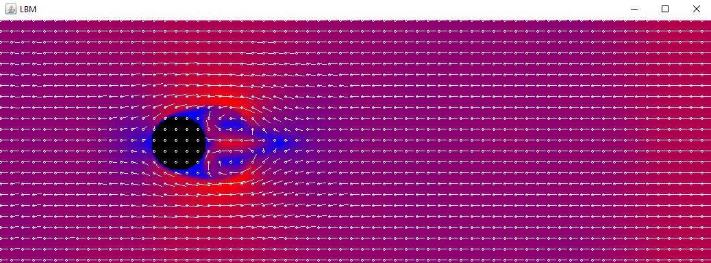

# Scientific Computing and Simulation

## Purpose

To explore how programming can be adapted to visualise scientific calculations in the medical or aerospace industry by implementing techniques such as the Fast Fourier Transform or an excitable system such as the Cellular Automata model.

## Usage

Clone the repository using Git.

```console
git clone https://github.com/UP927887/SciComp-Simulation-23.git
```

Open the cloned repo using your favourite IDE then run using a Java Compiler.

## Results

Results differ from each lab. For example the "Sample Lattice Boltzmann Code" outputs the following image, which represents the flow of air around an obstacle. Red meaning fast flow, whereas blue means slow flow.


